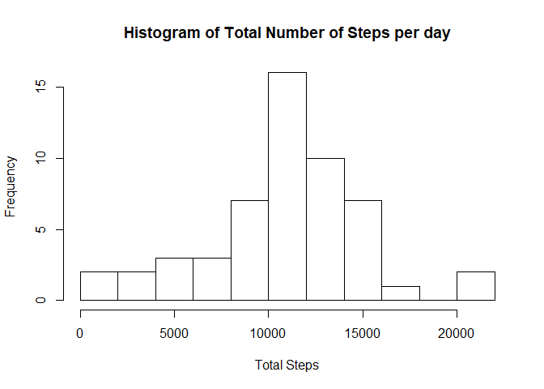
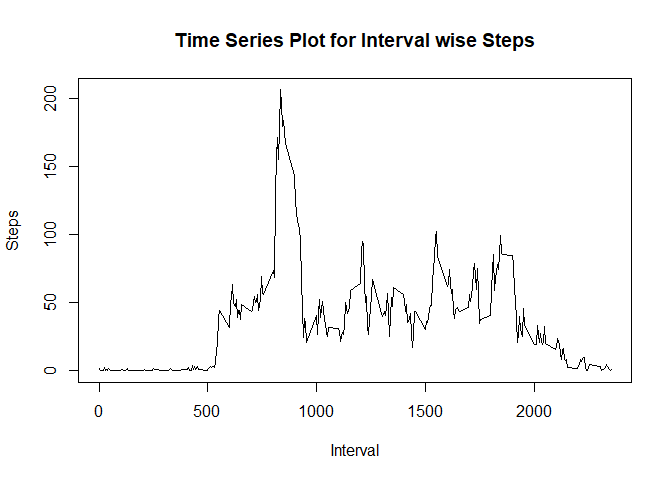
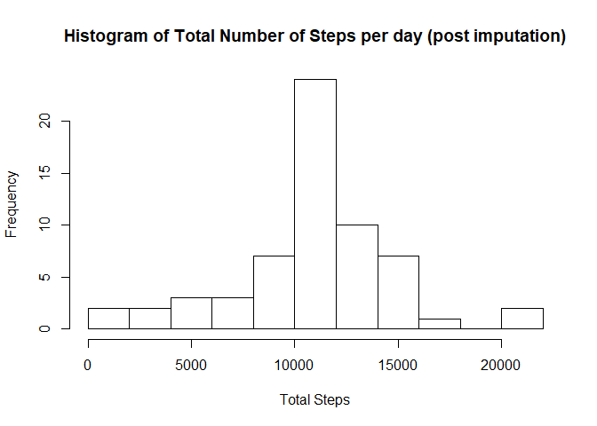
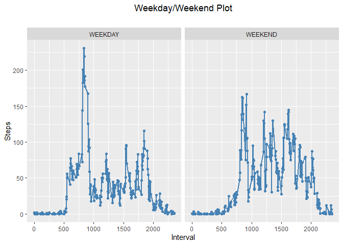

## Loading and preprocessing the data
We need to first check whether the CSV file is already extracted. If not then unzip the activity.zip file and extract the CSV file. Thereafter load the CSV file in a data frame named activity.

```r
if (!file.exists("activity.csv"))
{
  unzip("activity.zip")
}
activity <- read.csv("activity.csv")
head(activity)
```

```
##   steps       date interval
## 1    NA 2012-10-01        0
## 2    NA 2012-10-01        5
## 3    NA 2012-10-01       10
## 4    NA 2012-10-01       15
## 5    NA 2012-10-01       20
## 6    NA 2012-10-01       25
```

## What is mean total number of steps taken per day?

```r
datewise.steps <- with(activity[!is.na(activity$steps),],tapply(steps,date,sum))
hist(datewise.steps,breaks=10,main="Histogram of Total Number of Steps per day",xlab="Total Steps")
```

<!-- -->

```r
mean.steps <- format(mean(datewise.steps,na.rm=TRUE),scientific=FALSE)
media.steps <- median(datewise.steps,na.rm=TRUE)
```

1. Mean Steps = **10766.19**
2. Median Steps = **10765**

## What is the average daily activity pattern?

```r
intervalwise.mean <- with(activity[!is.na(activity$steps),],tapply(steps,interval,mean))
plot(names(intervalwise.mean),intervalwise.mean,type="l",main="Time Series Plot for Interval wise Steps", xlab="Interval", ylab="Steps")
```

<!-- -->

```r
max.intervalwise.mean <- max(intervalwise.mean)
max.interval.id <- names(which(intervalwise.mean==max.intervalwise.mean))
```
1. Max Interval on which activity was highest = **835**
2. The mean activity across all days at this interval = **206.1698113**

## Imputing missing values
On some data exploration we have observed that when a point is NA, the entire day's data is NA hence we cannot fill it with any of the points from that day. Now in the simplest algorithm, a person is likely to conduct the same activity at the same point of time in a day. Hence we will simply impute with the mean of the same interval id.

We already have an interval wise mean from previous result. We will leverage that.

We will create a new dataset named activity.imputed.

```r
total.na <- length(which(is.na(activity$steps)))
```
Total Number of Missing Values = **2304**

We are creating a data frame out of the interval wise mean vector to be merged with the activity data frame later.

```r
df.im <- data.frame(interval = names(intervalwise.mean),intervalmean = intervalwise.mean)
```

This activity vector is now merged with the above created interval wise mean data frame. Since only one column is common viz. interval, merge will be done on that. Thereafter for all the NA values, steps column will be replaced with interval mean.

```r
activity.imputed <- merge(activity,df.im)
activity.imputed[is.na(activity.imputed$steps),]$steps <- activity.imputed[is.na(activity.imputed$steps),]$intervalmean
total.na.imputed <- length(which(is.na(activity.imputed$steps)))
```
Total Number of Missing Values (post imputation) = 0


```r
datewise.steps.imputed <- with(activity.imputed,tapply(steps,date,sum))
hist(datewise.steps.imputed,breaks=10,main="Histogram of Total Number of Steps per day (post imputation)",xlab="Total Steps")
```

<!-- -->

```r
mean.steps.imputed <- format(mean(datewise.steps.imputed),scientific=FALSE)
median.steps.imputed <- format(median(datewise.steps.imputed),scientific=FALSE)
```
1. Mean Steps (post imputation) = **10766.19**
2. Median Steps (post imputation) = **10766.19**

We observe that mean is exactly the same. That is expected because the method we have chosen for imputation is such that mean will not shift. Median has shifted slightly to align with the mean.

## Are there differences in activity patterns between weekdays and weekends?


```r
activity.imputed$dayofweek <-activity.imputed$date
levels(activity.imputed$dayofweek) <-  weekdays(as.Date.character(levels(activity.imputed$dayofweek)))
levels(activity.imputed$dayofweek) <- ifelse(levels(activity.imputed$dayofweek) %in% c("Saturday","Sunday"),"WEEKEND","WEEKDAY")
```


```r
library(ggplot2)
```

```
## Warning: package 'ggplot2' was built under R version 3.6.3
```

```r
library(dplyr)
```

```
## Warning: package 'dplyr' was built under R version 3.6.3
```

```
## 
## Attaching package: 'dplyr'
```

```
## The following objects are masked from 'package:stats':
## 
##     filter, lag
```

```
## The following objects are masked from 'package:base':
## 
##     intersect, setdiff, setequal, union
```

```r
activity.summary <- activity.imputed %>%
  group_by(interval, dayofweek) %>%
  summarize(steps=mean(steps))
```

```
## `summarise()` has grouped output by 'interval'. You can override using the `.groups` argument.
```

```r
ggplot(data=activity.summary, aes(interval,steps)) +
  geom_line(color = "steelblue", size = 1) +
  geom_point(color = "steelblue") + 
  labs(title = "Weekday/Weekend Plot",
       subtitle = "",
       y = "Steps", x = "Interval") + 
  facet_grid(. ~ dayofweek) +
  theme(plot.title = element_text(hjust = 0.5))
```

<!-- -->

There are some differences in Weekday and Weekend plots. As we can see during weekdays there is a very sharp peak at a particular point in the day (perhaps the most popular workout times) whereas it is more or less uniform during weekends which is possibly explained by the fact that people tend to relax over the weekends.
